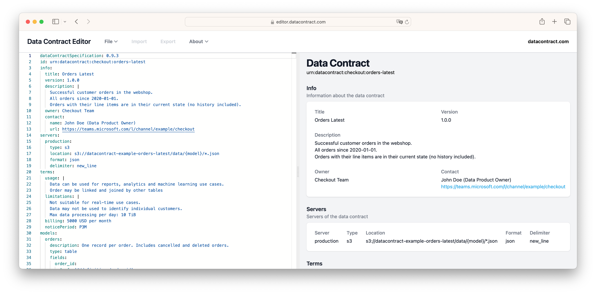

# Data Contract Editor

The [Data Contract Editor](https://editor.datacontract.com) is like VS Code, but for [data contracts](https://datacontract.com). It's enterprise-friendly as it stores your data contracts in your browser.

**Features**

- ✅ Syntax highlighting
- ✅ Code completion
- ✅ Error checking
- ✅ Privacy-friendly (no data leaves your browser)
- ✅ Live HTML preview
- ✅ Share data contracts via URLs

Try it out at [editor.datacontract.com](https://editor.datacontract.com).



## Development Setup

```bash
# run locally
npm install
npm run precompile # optional, only needed if you change the templates
npm run dev
```

```bash
# build for production
npm install
npm run precompile
npm run build
# deploy dist folder
```

## How to update the templates

Templates are taken from the Data Contract CLI and are fetched directly from the repository.
If you want to update them locally run `npm run update-templates`, whic will also be automatically run in the build.

## License

[MIT](LICENSE)

## Credits

Created by [Dr. Simon Harrer](https://www.linkedin.com/in/simonharrer/) and [Jochen Christ](https://www.linkedin.com/in/jochenchrist/).

Supported by [INNOQ](https://www.innoq.com).
