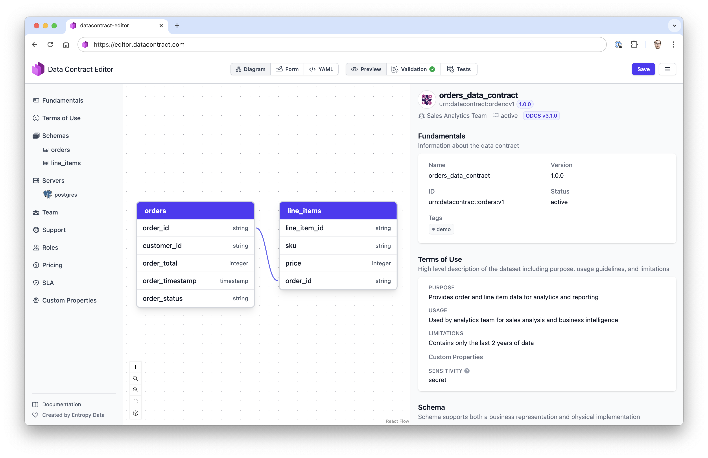

# Data Contract Editor

A web-based editor for creating and managing data contracts using the [Open Data Contract Standard](https://bitol-io.github.io/open-data-contract-standard/latest/) (ODCS).



## Features

- **Editing Modes**:
  - **Visual Editor**: Define data models and relationships using a visual interface
  - **Form Editor**: Get guided input from a simple form interface
  - **YAML Editor**: Edit data contracts in YAML format
- **Real-time Preview**: Live preview of data contracts with syntax validation
- **Validation**: Get instant feedback on your data contracts
- **Data Contract CLI Integration**: Run tests against your contracts using the Data Contract CLI API Server.


## Usage

### Web Editor

https://editor.datacontract.com


### Standalone Application

Coming soon!

```
npx datacontract-editor datacontract.yaml
```


### Data Contract CLI

Coming soon!

You can start the editor from the Data Contract CLI:

```
datacontract editor datacontract.yaml
```


### Entropy Data

[Entropy Data](https://entropy-data.com) is our commercial offering for managing data products with data contracts.


## License

This project is maintained by [Entropy Data](https://entropy-data.com) and licensed under the [MIT LICENSE](LICENSE).
